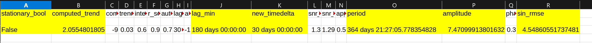

# SDStools/fromMark/analysis

This will contain scripts for analysis tools for CoastSeg shoreline data.

# Explanation with synthetic timeseries

Consider the following synthetic timeseries of shoreline postion, where the shoreline's cross-shore position is modelled by the simple equation:

y = trend + yearly pattern + noise

And additionally, let's take throw NaNs at random spots in this timeseries.

If we choose a random yearly trend, a random seasonal amplitude, and a noise value of 10 m, we might get a timeseries like the one below:

So in this example, a timeseries from 1984 to 2024, with a time-spacing of 12 days, the beach is growing at about 2 m/year, but it also has approximately a 15 m winter vs. summer oscillation.

Sadly, we are missing 5% of the the timeseries and there is random noise that might confuse us.

Can we still capture the trend accurately and the seasonality accurately, even though the timeseries is noisy and missing data?

Let's put this data through some timeseries analysis steps.

1. Resample the timeseries to deal with our data gaps. We shouldn't choose a resampling frequency that is finer than every 12 days. Otherwise we will run into aliasing problems. We'll do 30 days or about a month.

2. Linearly interpolate through any missing data, forwards and backwards, so that we have filled all of the NaNs in the timeseries.

3. Apply a median filter, a simple low-pass filter that can remove outliers. 

4. Check if the timeseries is stationary with an ADF test. A stationary timeseries has no temporal trend. A non-stationary timeseries will show a temporal trend. We already know this timeseries is non-stationary so this test should confirm this.

5. Estimate the trend by running the filtered timeseries through linear least squares. If we had uncertainty estimations for each data point, we could try doing a weighted least squares regression. Currently, we do not have a way of estimating uncertainty for individual satellite derived shoreline observations.

6. De-trend the timeseries and de-mean the timeseries. De-meaning here won't do anything, however, since the earliest point is already at 0 m. It is necessary for CoastSeg data because the cross-shore position is given in terms of a position along a transect that often starts far inland of the beach.

7. Compute the autocorrelation on the de-meaned timeseries. The autocorrelation shows how correlated a timeseries is with a lagged version of itself. We want to find strong negative correlation at half a year, since we know the timeseries should have a yearly cycle.

8. Use information from the autocorrelation to fit a sine wave to our de-trended and de-meaned data, estimating the seasonal amplitude, phase, and frequency/period.

Here's what the results of these steps would show:

The above figure shows how our timeseries looks differently after our series of processing steps.

This above figure shows the autocorrelation.

This figure shows the sinusoid fit.

This screenshot shows numeric results from our analysis steps. What did we learn?

* We confirmed the timeseries is non-stationary.
* The computed trend was fairly close to what the input trend was.
* The lag corresponding to the minimum autocorrelation (so maximum negative correlation) was 180 days (about half a year).
* This led us to estimating a best fit sin wave with an amplitude of 7.5 m, a period of just under 365 days, and an RMSE of 4.55 m.
* So in this case, we estimated the trend, the seasonal period, the seasonal amplitude, and the noise pretty well.
* More time gaps and more noise would obviously make this more difficult. As would having weaker trends and weaker seasonal amplitudes.

# shoreline_timeseries_analysis_single.py

Libraries required (Python 3.7, numpy, matplotlib, datetime, random, scipy, pandas, statsmodels, os, csv)

	main(csv_path,
             output_folder,
             name,
             which_timedelta,
	     median_filter_window=3,
             timedelta=None):
		"""
		Timeseries analysis for satellite shoreline data
		Will save timeseries plot (raw, resampled, de-trended, de-meaned) and autocorrelation plot.
		Will also output analysis results to a csv (result.csv)
		inputs:
		csv_path (str): path to the shoreline timeseries csv
		should have columns 'date' and 'position'
		where date contains UTC datetimes in the format YYYY-mm-dd HH:MM:SS
		position is the cross-shore position of the shoreline
		output_folder (str): path to save outputs to
		name (str): name to give this analysis run
		which_timedelta (str): 'minimum' 'average' or 'maximum' or 'custom', this is what the timeseries is resampled at
                median_filter_window (odd int): kernel length for median filter on timeseries, be aware of this params affect on autocorrelation!!
		timedelta (str, optional): the custom time spacing (e.g., '30D' is 30 days)
		beware of choosing minimum, with a mix of satellites, the minimum time spacing can be so 
		low that you run into fourier transform problems
		outputs:
		timeseries_analysis_result (dict): results of this cookbook
		"""
		
1. Resample timeseries to minimum, average, maximum, or a custom time delta (temporal spacing of timeseries).

2. Linear interpolation to fill NaNs.

3. Median filter to reduce noise. This is a decent filter aimed at removing outliers from timeseries (much more robust than a boxcar/moving average) that requires very little design. In other words, it's effective, it's simple, and it can be applied across a wide variety of data. We don't want to spend all of our time designing timeseries filters.

4. Check if timeseries is stationary with ADF test. We'll use a p-value of 0.05. If we get a p-value greater than this then we are interpreting
the timeseries as non-stationary (there is a temporal trend). 

5. 
	a) If the timeseries is stationary then de-mean it, compute and plot autocorrelation, compute approximate entropy (measure of how predictable 		the timeseries is, values towards 0 indicate predictability, values towards 1 indicate random).

	b) If the timeseries is non-stationary then compute the trend with linear least squares,
	and then de-trend the timeseries. Then de-mean, do autocorrelation, and approximate entropy.

6. This will return a dictionary with the following keys:

	* 'stationary_bool': True or False, whether or not the input timeseries was stationary according to the ADF test.
	* 'computed_trend': a computed linear trend via linear least squares, m/year
	* 'computed_intercept': the computed intercept via linear least squares, m
	* 'trend_unc': the standard error of the linear trend estimate, m/year
	* 'intercept_unc': the standard of error of the intercept estimate, m
	* 'r_sq': the r^2 value from the linear trend estimation, unitless
	* 'autocorr_max': the maximum value from the autocorrelation estimation, this code computes the maximum of the absolute value of the 			autocorrelation
	* 'lag_max': the lag that corresponds to the maximum of the autocorrelation, something of note here: if you are computing autocorrelation on
	* 'autocorr_min': the second largest autocorrelation value
	* 'lag_min': the lag that corresponds to the second largest autocorrelation value
	a signal with a period of 1 year, then here the lag_max will be half a year. Autocorrelation in this case should be -1 at a half-year lag and 	+1 at a year lag. Since I do the max calculation on the absolute value of the autocorrelation, you get lag_max at the maximum negative 	correlation.
	* 'new_timedelta': this is the new time-spacing for the resampled timeseries
	* 'snr_no_nans': a crude estimate of signal-to-noise ratio, here I just did the mean of the timeseries divided by the standard deviation
	* 'snr_median_filter': same estimate of signal-to-noise, but performed after the median filter is applied
	* 'approx_entropy': entropy estimate, values closer to 0 indicate predicatibility, values closer to 1 indicate disorder

main_df will take as input a pandas dataframe instead of a path to a csv. 
It will output the result dictionary, the resampled pandas dataframe, and the new timedelta.

# shoreline_timeseries_analysis_single_spatial.py

	def main(csv_path,
			 output_folder,
			 name,
			 transect_spacing,
			 which_spacedelta,
			 spacedelta=None):
		"""
		Spatial analysis for satellite shoreline data
		inputs:
		csv_path (str): path to the shoreline timeseries csv
		should have columns 'transect_id' and 'position'
		where transect_id contains the transect id, transects should be evenly spaced!!
		position is the cross-shore position of the shoreline (in m)
		output_folder (str): path to save outputs to
		name (str): a site name
		transect_spacing (int): transect spacing in meters
		which_spacedelta (str): 'minimum' 'average' or 'maximum' or 'custom this is the new longshore spacing to sample at
		spacedelta (int, optional): if custom specify new spacedelta, do not put finer spacing than input!!
		outputs:
		spatial_series_analysis_result (dict): results of this cookbook
		"""
		
1. Resample spatial series to minimum, average, or maximum spatial delta (longshore spacing of spatial series). My gut is to go with the maximum so we aren't creating data. If we go with minimum or average then linearly interpolate the values to get rid of NaNs.

2. Check if spatial series is stationary with ADF test. We'll use a p-value of 0.05. If we get a p-value greater than this then we are interpreting
the timeseries as non-stationary (there is a temporal trend). 

3. 
	a) If the spatial series is stationary then de-mean it, compute and plot autocorrelation, compute approximate entropy (measure of how 	predictable the timeseries is, values towards 0 indicate predictability, values towards 1 indicate random).

	b) If the spatial series is non-stationary then compute the trend with linear least squares,
	and then de-trend the spatial series. Then de-mean, do autocorrelation, and approximate entropy.

4. This will return a dictionary with the following keys:

	* 'stationary_bool': True or False, whether or not the input timeseries was stationary according to the ADF test.
	* 'computed_trend': a computed linear trend via linear least squares, m/m
	* 'computed_intercept': the computed intercept via linear least squares, m
	* 'trend_unc': the standard error of the linear trend estimate, m/m
	* 'intercept_unc': the standard of error of the intercept estimate, m
	* 'r_sq': the r^2 value from the linear trend estimation, unitless
	* 'autocorr_max': the maximum value from the autocorrelation estimation, this code computes the maximum of the absolute value of the 			autocorrelation
	* 'lag_max': the lag that corresponds to the maximum of the autocorrelation, something of note here: if you are computing autocorrelation on
	a signal with a period of 1000m, then here the lag_max will be 500m. Autocorrelation in this case should be -1 at a 500m lag and 			+1 at a 1000m lag. Since I do the max calculation on the absolute value of the autocorrelation, you get lag_max at the maximum negative 		correlation.
	* 'new_spacedelta': this is the new longshore-spacing for the resampled timeseries (in m)
	* 'snr_no_nans': a crude estimate of signal-to-noise ratio, here I just did the mean of the spatial series divided by the standard deviation
	* 'approx_entropy': entropy estimate, values closer to 0 indicate predicatibility, values closer to 1 indicate disorder
	
main_df will take as input a pandas dataframe instead of a path to a csv. 
It will output the result dictionary, the resampled pandas dataframe, and the new spacedelta.

# coastseg_time_and_space_analysis_matrix.py

	def main(transect_timeseries_path,
			 config_gdf,
			 output_folder,
			 transect_spacing,
			 which_timedelta,
			 which_spacedelta,
			 median_filter_window=3,
			 timedelta=None,
			 spacedelta=None):
		"""
		Performs timeseries and spatial series analysis cookbook on each
		transect in the transect_time_series matrix from CoastSeg
		inputs:
		transect_timeseries_path (str): path to the transect_time_series.csv
		config_gdf_path (str): path to the config_gdf.geojson
		output_folder (str): path to save outputs to
		which_timedelta (str): 'minimum' 'average' or 'maximum' or 'custom', this is what the timeseries is resampled at
		which_spacedelta (str): 'minimum' 'average' or 'maximum' or 'custom', this is the matrix is sampled at in the longshore direction
                median_filter_window (odd int): kernel length for median filter on timeseries
		timedelta (str, optional): the custom time spacing (e.g., '30D' is 30 days)
		beware of choosing minimum, with a mix of satellites, the minimum time spacing can be so low that you run into fourier transform 		problems
		spacedelta (int, optional): custom longshore spacing, do not make this finer than the input transect spacing!!!!
		outputs:
		new_matrix_path (str): path to the output matrix csv
		"""

Performs time and space analysis on entire matrix of shoreine data from CoastSeg. Will save a resampled matrix.