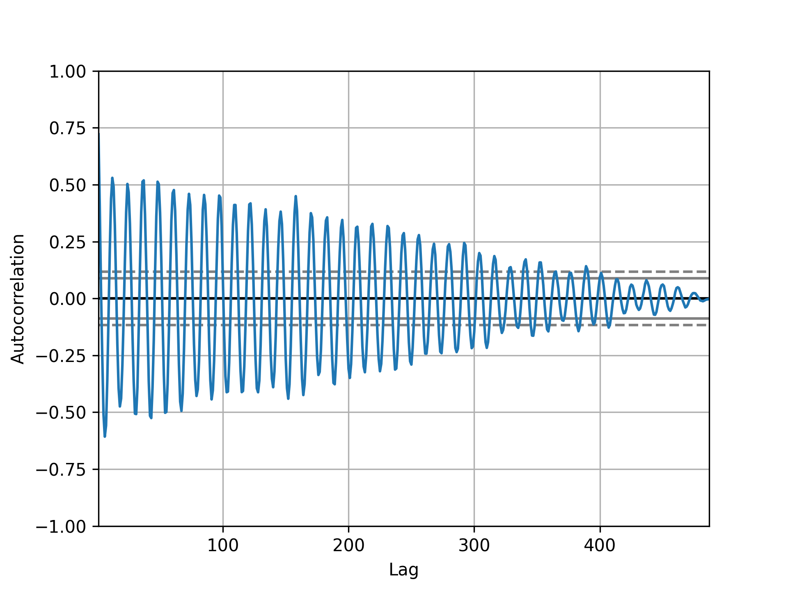
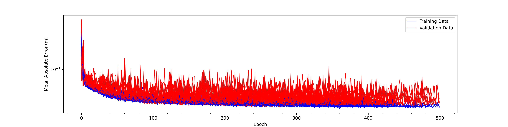
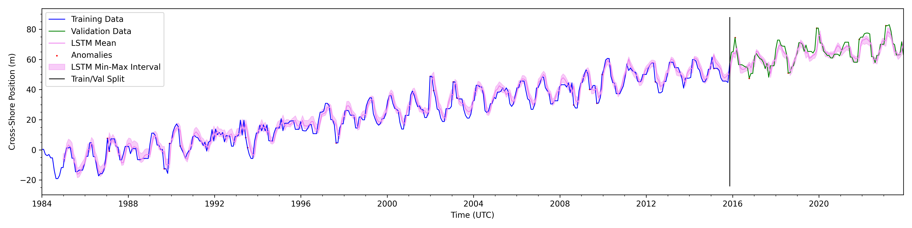
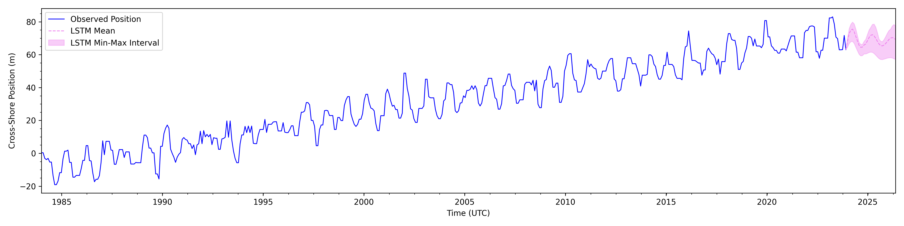
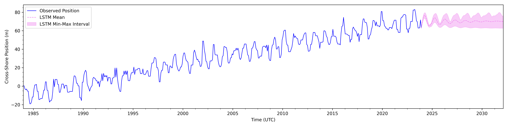

# SDStools/fromMark/prediction

Some tools for building data-driven predictive models from satellite shoreline data.

Here we are using bootstrapped bidirectional long short-term memory networks.

Requirements: python>=3.7, tensorflow<=1.14.0, pandas, matplotlib, scikit-learn, numpy, shapely, geopandas, statsmodels

Can try making this conda environment with the yml file.
	
	cd path/to/SDStools/fromMark/prediction
	
	conda env create --file shoreline_prediction.yml

# Explanation

Disclaimers: 
1. Using empirical observations to explain and predict the future is, always has been, and always will be plagued by the induction fallacy. This is why scientists use mathematics and physics to develop theory and theory-based models for predicting future events. Generalizations can always be disproved by finding one counterexample. 
2. Complex systems are extremely hard to predict because of sensitivity to initial conditions as well as feedback loops that can amplify processes.
3. Data-driven models are only as good as the data being fed into those models.
4. Random processes are, by definition, unpredictable.
5. Determining a measured process is random does not necessarilly imply that that process is actually random. It could imply that the way it is being measured results in those measurements being random.

Neural networks (spefiically recurrent neural networks, or in this case long short-term memory (LSTM) networks) are somewhat powerful tools
for timeseries modeling. If they were actually powerful we would be able to predict many things a lot better.

They can be designed in a variety of ways, sometimes with univariate timeseries data, sometimes with multivariate timeseries data.

A univariate timeseries is just tracking how one variable (e.g., shoreline position) changes over time. 

Multivariate timeseries tracks how multiple variables (e.g., shoreline position, wave height, wave period) change over time.

A neural network (NN) can be designed to output future values based on past values in a timeseries.

In the univariate case, the NN would be using past values in a single timeseries to output the next value or a sequence of future values based on past values in that timeseries.

In the multivariate case, the NN could be designed to take as input past values from each variable's timeseries and output a value (or sequence) for one variable or multiple variables. 

In the context of shoreline modeling, we could have as input a timeseries of shoreline position ($y$), wave height ($H$), and wave period ($T$).
We could then train a model to use $k$ past values of each of those variables to output the next shoreline position ($y_{i+1}$).

$$y_{i+1} = f([y_i, y_{i-1}, ... y_{i-k}], 
	      [H_i, H_{i-1}, ..., H_{i-k}], 
              [T_i, T_{i-1}, ..., T_{i-k}])$$

Additionally, we could take as input several timeseries of shoreline positions, taken from $n$ transects along a beach, as well as timeseries of wave height and wave period ($H$, $T$), and then train a model to output the next shoreline position ($y_{i+1, j}$) for all $n$ transects. We would probably only want to do this in "closed" systems like a single littoral cell. We could probably use a single offshore wave buoy to get our wave data.

$$Y_{i+1} = [y_{i+1, 1}, y_{i+1, 2}, ..., y_{i+1, n}] = f([y_{i, 1}, y_{i-1, 1}, ..., y_{i-k, 1}], 
							  [y_{i, 2}, y_{i-1, 2}, ..., y_{i-k, 2}], ..., [y_{i, n}, y_{i-2, n}, ... y_{i-k, n}], 
							  [H_i, H_{i-1}, ..., H_{i-k}], 
							  [T_i, T_{i-1}, ..., T_{i-k}])$$

We could also just use the shoreline position timeseries as input (either single or multiple at various transects along a beach).

Ok so now let's investigate the folloiwng question: Can LSTMs help with forecasting shoreline change?

First, I want to run through the typical steps for building a neural network aimed at timeseries prediction.

1. We need to decide a model architecure to use. After an exhaustive literature search, I decided on using bidirectional LSTMs.
These are at the forefront of deep learning-based timeseries modeling. Transformers might be slightly more effective, but I will leave that exploration for the future (maybe) or for the reader. Any DL model will have the same pitfalls as will be demonstrated later on. Stay away from repos that claim to have great timeseries prediction models. They usually are just overly-complex models that perform well on simple, canned data. If they were actually as good as they claim, again, we would be able to predict things much better. 
2. Next we need to write the code to implement your model. I chose to use Keras because it is a somewhat elegantly designed library that 
has a lot of contributors that aim to maintain it. 
3. Next you need data to run your code on. I am interesting in modeling shoreline change, so I decided to use timeseries data of cross-shore position obtained from CoastSeg.
4. We need to do some analysis on our data to extract information on signal-to-noise ratio, entropy, stationarity, temporal trends, and seasonality. If our data has a low signal-to-noise ratio or high entropy, it's too random to develop any predictive model better than a 
random walk, rendering the rest of this exercise as useless. This might be due to the quality of our data, or, the process we are studying, according to the way we measure it, is unpredictable.
5. Train the LSTM model. This requires the selection of a variety of hyperparameters:
* Batch size: this is how much of the timeseries we feed into the model during each iteration of training. After an iteration, the weights in the model get updated. Higher batch sizes can result in faster training times, but that can also result in a less-effective model. Think about why that might be. We are going to use a batch size of 32.
* training/validation split: How much of the data is used for training and how much is used for validation. You can also have an additional test dataset. The training dataset is used to update model weights. The validation dataset is used to track model error independently during training. The test dataset would be a holdout set that is not used during training at all and used for model error estimation after training 	is complete. We are going to use an 80/20 split (first 80% of timeseries for training, last 20% for validation).
* Training epochs: how many times the model is shown the complete training dataset during training. This can be easilly estimated by using an early-stopping callback. In other words, you halt training once the validation loss stops improving, and restore the weights that resulted in the model with the lowest error on the validation dataset. We just pick a high number (1000) and let the model use an early-stopping callback.
* LSTM units: the horizontal complexity of the LSTM layer or number of hidden units in the LSTM layer. We will use 64.
* Lookback value or lag value: how many previous values (in terms of timesteps) are used in generating predictions. For a timeseries sampled every 30 days, using a lookback value of 6 implies you are using six months of data to predict the next month's value. This we need to choose AFTER doing some seasonal analysis on our data. We need to find the most dominant frequency in our data and then use that to guide our choice for lookback value. If you do this blindly and try grid-searching for the correct lookback value, you will find that using a lookback value of 1 timestep is best. This results in a model that just spits out the previous value, and then blows up when it is left to its own devices.
* Recurrent dropout (I keep this constant at 0.5): this is a clever way of keeping some randomness and avoiding overfitting. Basically you ignore some of the weights during each iteration when you update them based on the backpropagated error.
* loss function: we will use mean absolute error so our losses are actually interpretable (in units of meters).
* We will also use the rectified linear unit (ReLu) for our activation function and Adam as our optimizer. 
6. We might find we have an awesome model that performs well on our validation data. But how well does it perform once we let it loose? Can it continue to make meaningful predictions when we run it recursively, or use its own outputs as inputs? If it generates junk, then think of what we actually have: an extremely complicated black-box model that can predict accurately what has already been observed, but fails miserably when predicting future events. This type of model is only useful if we constantly retrain it as new data comes in. Think of how hard that is to actually implement. 

# Univariate Example with Synthetic Timseries

1.  Consider the following synthetic timeseries of shoreline postion, where the shoreline's cross-shore position is modelled by the simple equation:

* y = trend + yearly pattern + noise

* And additionally, let's take throw NaNs at random spots in this timeseries.

* If we choose a random yearly trend, a random seasonal amplitude, and a noise value of 10 m, we might get a timeseries like the one below:

* So in this example, a timeseries from 1984 to 2024, with a time-spacing of 12 days, the beach is growing at about 2 m/year, but it also has 	  approximately a 15 m winter vs. summer oscillation.

* First we will run it through the timeseries analysis cookbook in SDSTools/fromMark/analysis/shoreline_timeseries_analysis_single.py

* Our new timeseries was resampled at 30 days and we find the minimum autocorrelation at a lag of 180 days, indicating a yearly pattern.
	

2.  Next we would use SDSTools/fromMark/prediction/lstm_coastseg_single_transect.py to train a univariate LSTM model.
	
* Let's use a lookback value of 12 timesteps or 1 year.

* Let's repeat training 30 times to get a confidence interval for the model outputs.
	
* Let's project the model 30 timesteps (so 30 months) beyond the observed data's temporal range to see what our model does once it is only 	  using its own outputs as model inputs.
	

* Here we see our loss plot showing how both the training and validation losses converged over more training epochs.

* Here we see how our model performed in the training and validation portions. 
	

* And here we see how our model performs when it is forecasting. It seems to be able to continue the yearly pattern but can't maintain the increasing trend. 

* We can see this more clearly if we forecast for 100 timesteps (100 months).

* This example only used past shoreline positions to predict the next shoreline position. Perhaps we would see how the model performs with 	  extra predictive variables (e.g., $H$, $T$). This might improve the model's performance on the validation data. It's doubtful that the forecasting ability will improve though. We could, however, get a better understanding of the importance of various wave parameters' effect on shoreline position. Just from a correlation/variance explanation persepective though.

* Currently it makes more sense to work on improving the accuracy, temporal frequency, record-length, and geographic scope of our satellite-derived shoreline observations. If we wanted a predictive NN model that was actually useful, we would need better (and more) inputs.

* An autoregressive integrated moving average model could potentially be more useful for forecasting.
	
* You might have noticed that the plot showing predictions over the training and validation sections had anomalies marked. These were points in the timeseries that were far out of the prediction's confidence bounds. This could be useful for flagging anomalous events or bad data in our shoreline timeseries. I defined the anomalies by computing the absolute difference between the mean predictions and the obeserved data points, and then by flagging all points that were outside of that array of differences' 95% confidence interval. Anomaly detection could be a sensible use of NNs on timeseries data currently.

* Another area this could be useful is interpolation of our shoreline data (filling in time gaps).

* Take a look in the examples folder to see how using a less complex LSTM model (fewer hidden units) affects the results.

# Before you use

Generate tidally corrected shoreline data with CoastSeg.

You will need the file 'tidally_corrected_transect_time_series.csv' and 'config_gdf.geojson'.

# Step 1: lstm_parallel_coastseg.py

Run 'tidally_corrected_transect_time_series.csv' through SDSTools/fromMark/analysis/coastseg_time_and_space_analysis_matrix.py.

This ensures that you get an evenly sampled matrix in the time and space domain. There is a ton more information this script outputs too.

We will work with the file 'timeseries_mat_resample_time_space.csv'.

This file is indexed by time, with column names corresponding to transect ids, 
and the matrix filled with tidally corrected cross-shore positions. 
These positions are referenced to a position along a transect from the config_gdf.geojson.

So gather 'timeseries_mat_resample_time_space.csv' and the 'config_gdf.geojson' you used in CoastSeg.

The script to use is lstm_parallel_coastseg.py.

	def main(sitename,
		 coastseg_matrix_path,
		 bootstrap=30,
		 num_prediction=30,
		 num_epochs=2000,
		 units=64,
		 batch_size=32,
		 look_back=3,
		 split_percent=0.80,
		 freq='30D'):
		"""
		Trains parallel LSTM model on shoreline data
		inputs:
		sitename (str): name of the sitename/study area
		coastseg_matrix_path (str): path to the matrix output from coastseg_time_and_space_analysis_matrix.py
		bootstrap (int): number of times to train the model
		num_prediction (int): number of timesteps to project model
		num_epochs (int): number of epochs to train the model
		units (int): number of units for LSTM layers
		batch_size (int): batch size for training
		look_back (int): number of previous timesteps to use to predict next value
		split_percent (int): fraction of timeseries to use as training data
		freq (str): timestep, this should match the timedelta of the coastseg_matrix
		"""

Try running this on your data with the default values for

* bootstrap (re-training more than 30 times is overkill)
* num_prediction (a note here: given a freq of 30D and a num_prediction of 30, you are projecting the model 30 months into the future)
* num_epochs (this should just be a large integer, there is an early stopping callback when the validation loss is minimized)
* units (units beyond 64 tend to overcomplicate the model and you get diminishing returns)
* batch_size (making this too large can potentially inflate your validation loss and perhaps make a less-effective model)
* look_back (keep in mind the record length, or number of timesteps, in your data--if you make this too large you will get size errors)
* split_percent (the model needs training data and it also needs validation data, be wise about this)

Make sure freq matches the time-spacing you used in SDSTools/fromMark/analysis/coastseg_time_and_space_analysis_matrix.py.

This will output two plots and two csvs for each transect (one for the observed temporal range and one for the forecasted temporal range).

It will also output history csvs for each training run and a final plot showing the loss curves over each training run.

It will also output two csvs:

* 'predict_stacked.csv'(observed temporal period)
* 'forecast_stacked.csv' (forecast temporal period)

where all of the data is stacked (with an additional column 'transect_id' indicating which transect the data is from). 
 
 # Step 2: lstm_2D_projection_coastseg.py
 
 This script takes the outputs from lstm_parallel_coastseg.py and makes GIS outputs:
 mean shorelines and confidence interval polygons.
 
	 def main(sitename,
		  coastseg_matrix_path,
		  forecast_stacked_df_path,
		  predict_stacked_df_path,
		  save_folder,
		  config_gdf_path,
		  switch_dir=False):
		"""
		Takes projected cross-shore positions and uncertainties and constructs 2D projected shorelines/uncertainties
		Saves these to two shapefiles (mean shorelines and confidence intervals)
		inputs:
		sitename: Name of site (str)
		coastseg_matrix_path: path to the resampled coastseg matrix (str)
		model_folder: path ot the folder containing lstm results (str)
		save_folder: folder to save projected shoreline shapefiles to (str)
		config_gdf_path: path to config_gdf.geojson containing transects (str)
		switch_dir: Optional, if True, then transect direction is reversed
		"""

So for this script, you need the path to the 'timeseries_mat_resample_time_space.csv' which gets made
from SDSTools/fromMark/analysis/coastseg_time_and_space_analysis_matrix.py.

You also need the path to the stacked forecasts and predictions which are output from lstm_parallel_coastseg.py:
 'forecast_stacked.csv' and 'predict_stacked.csv'
 
 You will also need the path to the config_gdf made during CoastSeg:
 'config_gdf.geojson'
 
 Give it a folder to save everything to (save_folder). 
 
 If your transects are in the wrong direction you can set switch_dir to True.
 
 This will output new csvs for the observed temporal period and forecasted temporal period, and for each transect with the additional columns:
 
* eastings_mean_utm
* northings_mean_utm
* eastings_upper_utm
* northings_upper_utm
* eastings_lower_utm
* northings_lower_utm
* eastings_mean_wgs84
* northings_mean_wgs84
* eastings_upper_wgs84
* northings_upper_wgs84
* eastings_lower_wgs84
* northings_lower_wgs84
 
 So basically all of the model outputs' coordinates in utm and wgs84.
 
 It will also stack these csvs into two dataframes (forecast_stacked.csv and predict_stacked.csv).
 
 Finally, it will output four geojsons:
 * One will have the mean shorelines during the observed temporal period.
 * One will have the confidence interval polygons during the observed temporal period.
 * One will have the mean shorelines during the forecasted temporal period.
 * One will have the confidence interval polygons for the forecasted temporal period.
 
 These geojsons will have the timestamps and year as columns that may be useful for constructing maps.
 
 # Future Work
 
 Will potentially add in independent variables (e.g., waves).
 

